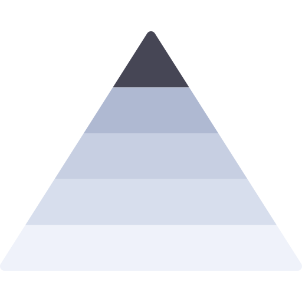
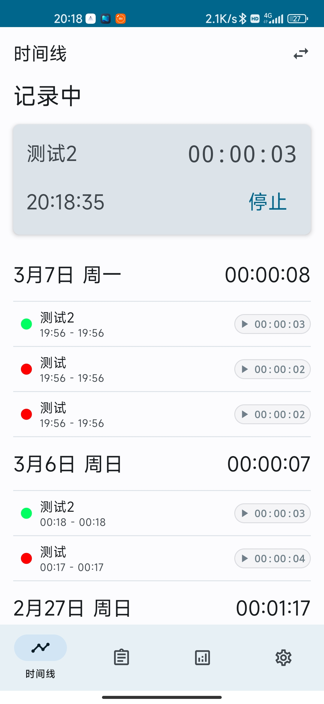
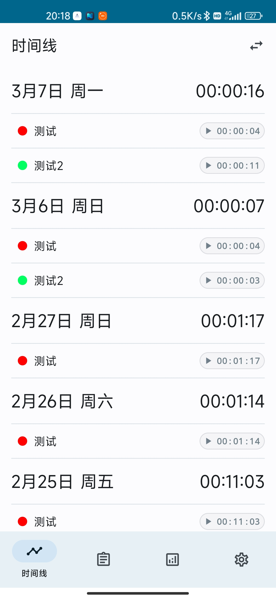
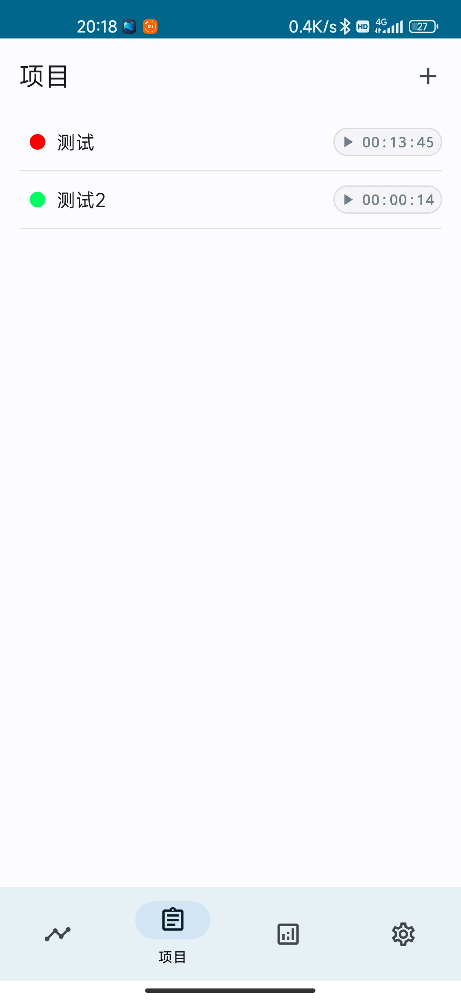
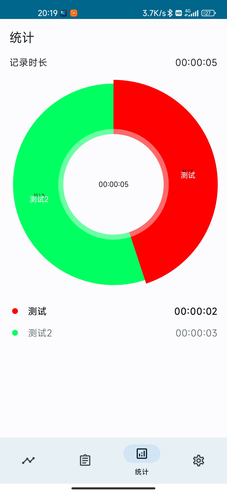
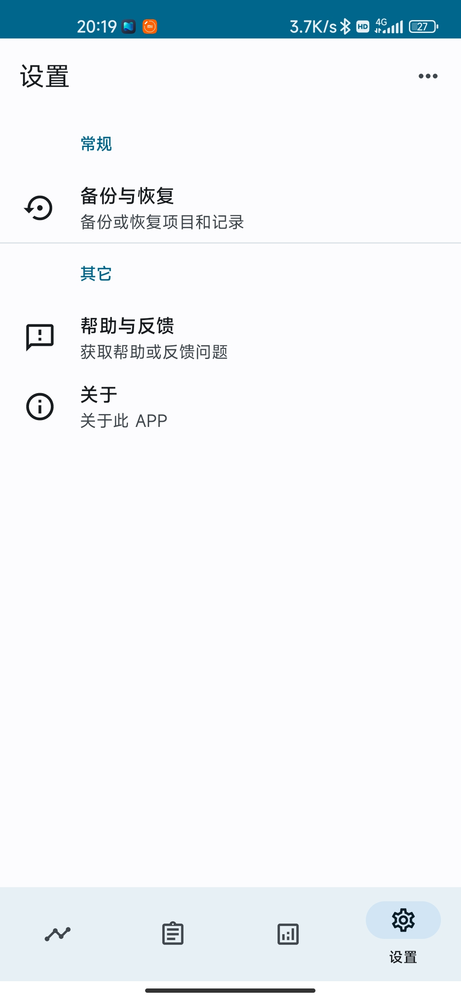

# 时迹

> 一款记录任务时间的时间管理应用。

  
  
  

## 简介

时迹一款记录各项任务时间的时间管理应用，可以帮助你了解自己的时间分配，提高工作效率。

使用 Jetpack Compose 构建，采用 Material You 设计，已完成项目记录、管理和统计等基本功能，UI 界面将随 Jetpack Compose 的更新逐步完善。

## 功能介绍

### 时间线

时间线按时间顺序展示所有记录，点击右上角切换图标可以切换普通视图和项目视图。

### 项目

显示所有项目，点击可查看项目所有记录或者修改项目信息。

### 统计

显示指定时间段（暂只支持当天）的统计数据。

### 设置

包括备份与回复（待完善）、帮助与反馈功能和关于页面。

