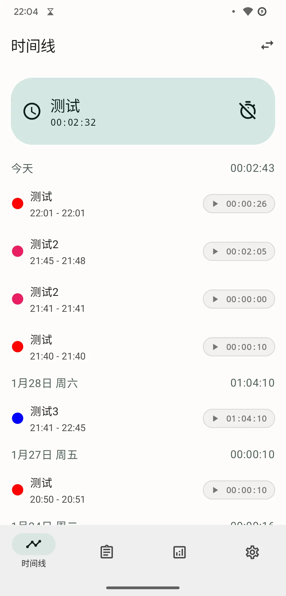
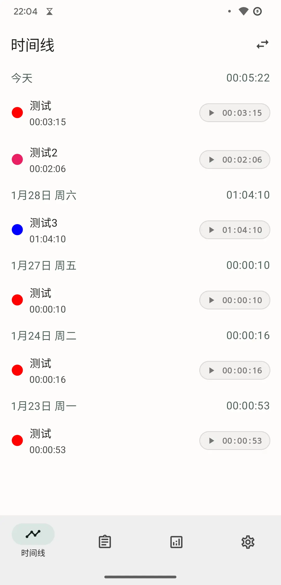
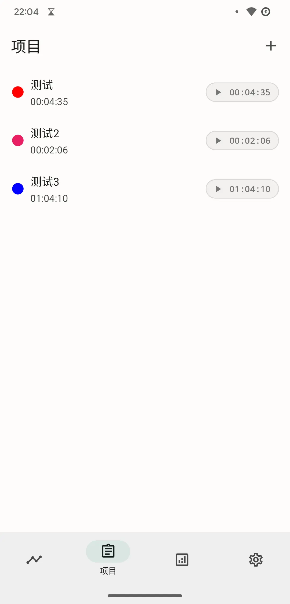
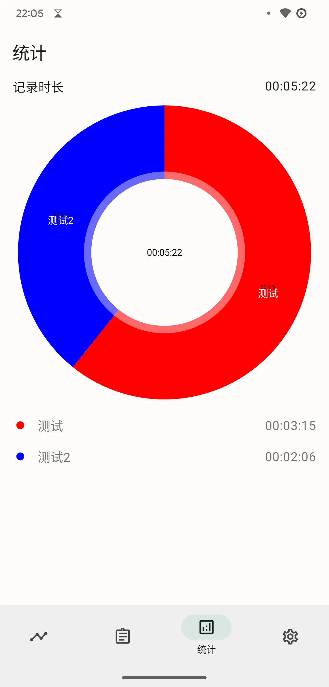
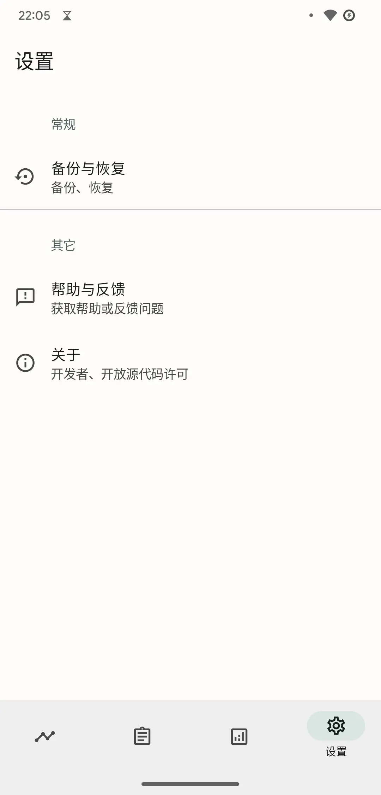
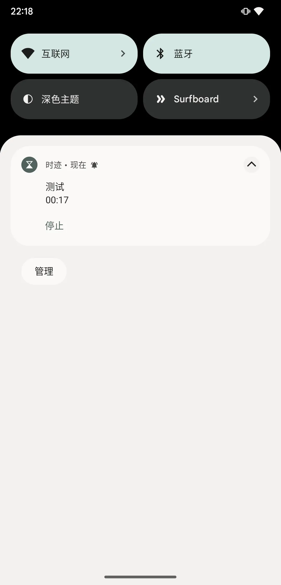
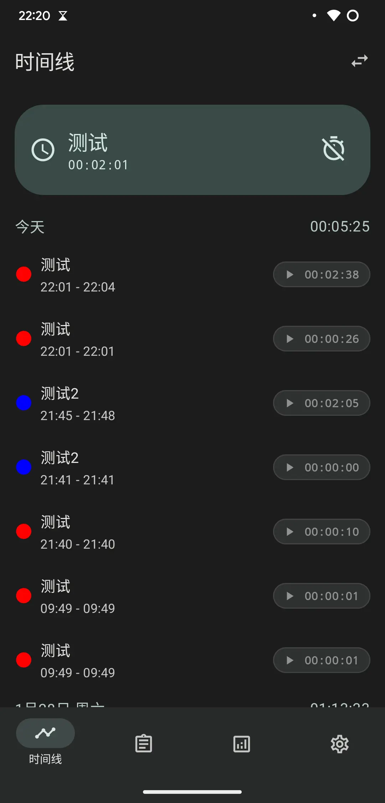
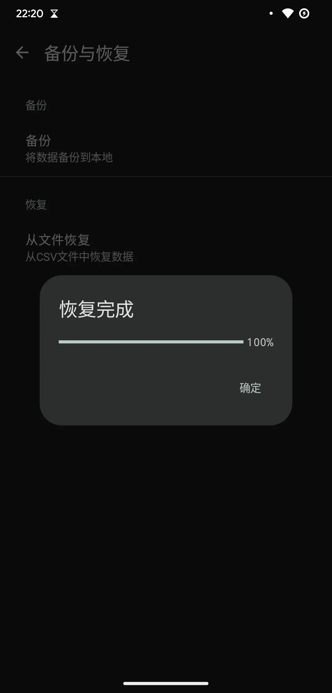

---
# https://vitepress.dev/reference/default-theme-home-page
layout: home

hero:
  name: "时迹"
  tagline: "一款记录任务时间的时间管理应用"
  actions:
    - theme: brand
      text: 查看帮助
      link: /help/index
---

## 简介

时迹一款记录各项任务时间的时间管理应用，可以帮助你了解自己的时间分配，提高工作效率。

使用 Jetpack Compose 构建，采用 Material You 设计，已完成项目记录、管理和统计等基本功能，UI 界面将随 Jetpack Compose 的更新逐步完善。

该应用将拥有以下特点：

- [x] 数据持久化保存，重启后可继续计时
- [x] 数据可备份和恢复
- [x] 适配深色模式
- [ ] 快捷方式（Shortcuts）
- [ ] 微件
- [ ] 数据统计
- [ ] ……

## 功能介绍

### 时间线

时间线按时间顺序展示所有记录，点击右上角切换图标可以切换普通视图和项目视图。

### 项目

显示所有项目，点击可查看项目所有记录或者修改项目信息。

### 统计

显示指定时间段（暂只支持当天）的统计数据。

### 设置

包括备份与恢复、帮助与反馈功能和关于页面。

## 截图

| 时间线                                                       | 时间线                                                       | 项目                                                      | 统计                                                         |
| ------------------------------------------------------------ | ------------------------------------------------------------ | --------------------------------------------------------- | ------------------------------------------------------------ |
|  |     |  |  |
| 设置                                                         | 通知                                                         | 深色                                                      | 恢复                                                         |
|     |  |          |       |
